# AparatExpressGraphQLTS - GraphQL Web Service for Aparat Clone

AparatExpressGraphQLTS is a TypeScript-based GraphQL web service designed to mimic the functionality of the popular video sharing platform Aparat (similar to YouTube). This project utilizes the Express framework to create a custom GraphQL API, providing users with features for uploading, viewing, and interacting with videos and other media content.

## Features

- User authentication and authorization.
- Video upload, storage, and retrieval.
- Video categorization and tagging.
- User interactions such as likes, comments, and views.
- Comprehensive search functionality.
- GraphQL API for flexible and efficient data retrieval.

## Technologies Used

- **Node.js**: A JavaScript runtime built on Chrome's V8 JavaScript engine.
- **Express**: A fast, unopinionated web framework for Node.js.
- **GraphQL**: A query language for APIs that enables more efficient and flexible data retrieval.
- **TypeScript**: A typed superset of JavaScript that compiles to plain JavaScript.
- **Prisma**: A NoSQL database for storing and managing data.

## Prerequisites

Before you begin, ensure you have met the following requirements:

- Node.js installed (https://nodejs.org/)
- MongoDB installed and running (https://www.mongodb.com/try/download/community)
- Git (optional) for cloning the repository


## Demo 

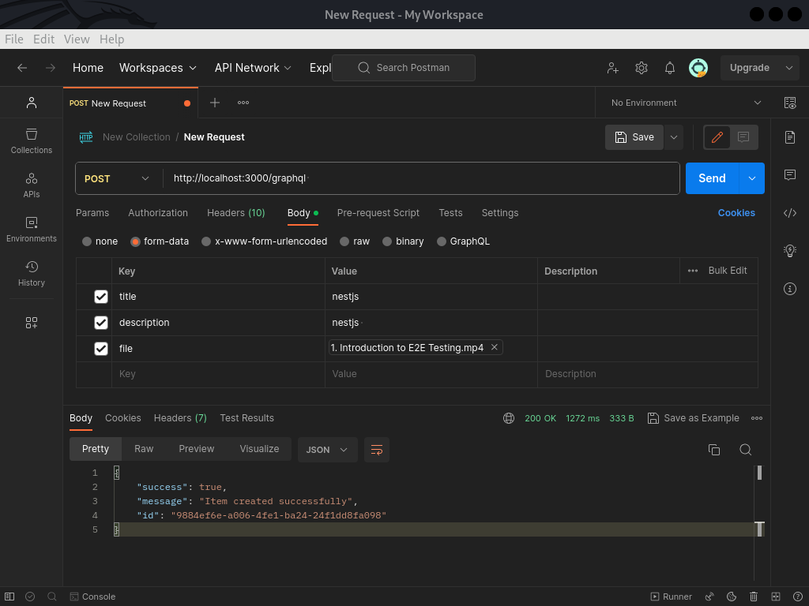

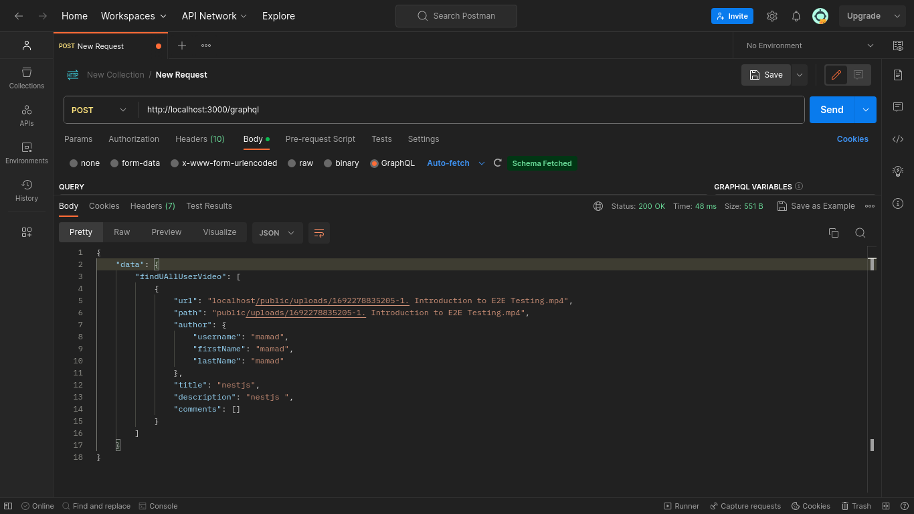

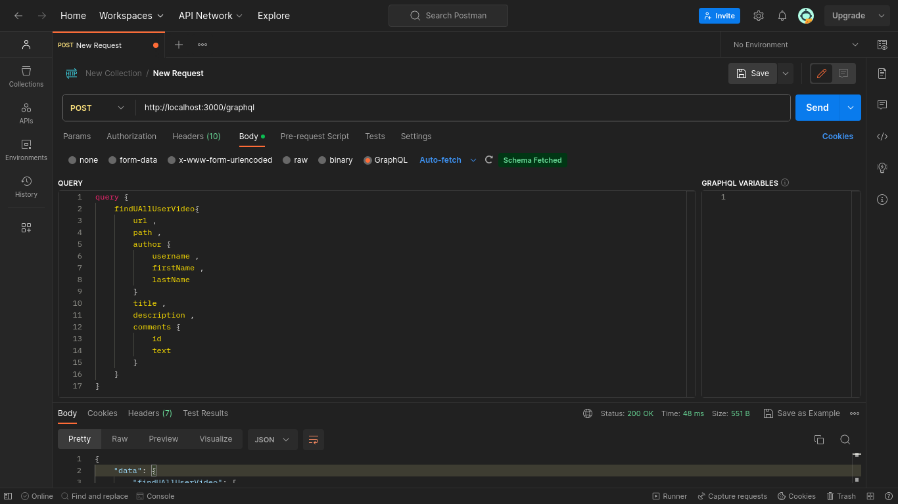

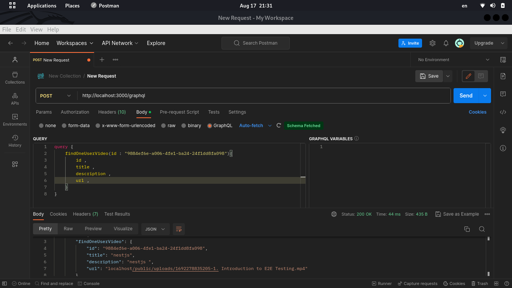

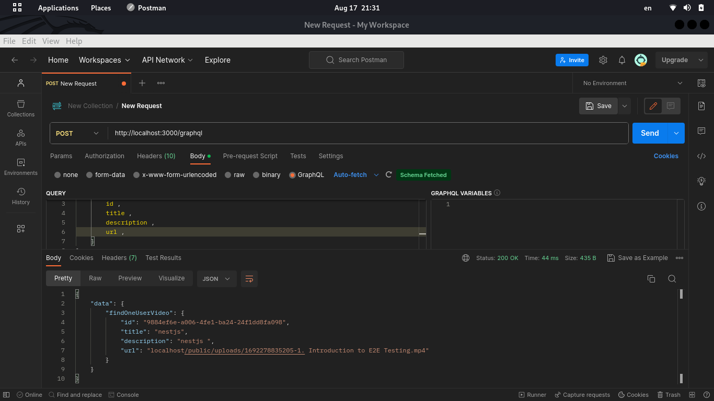

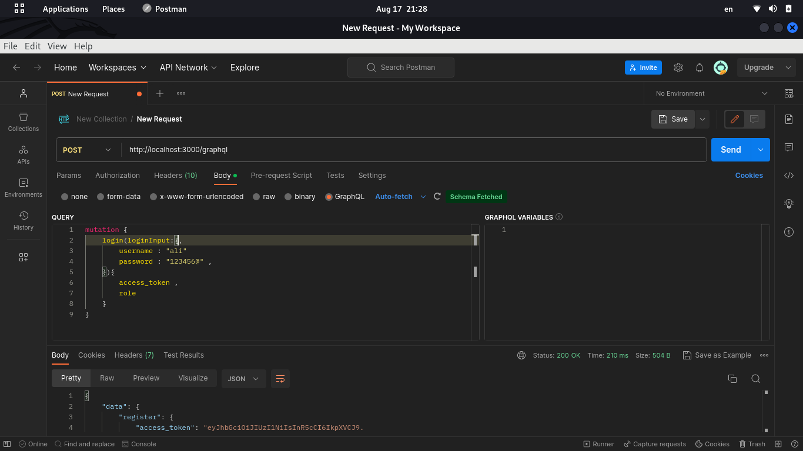

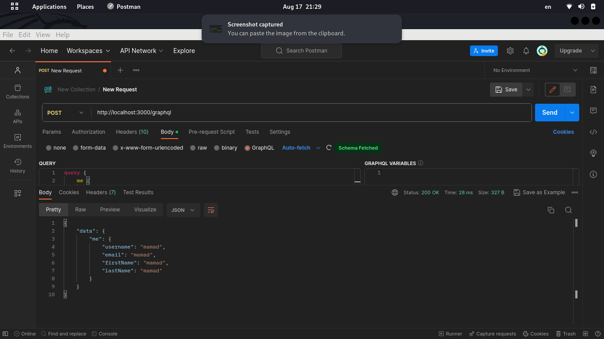

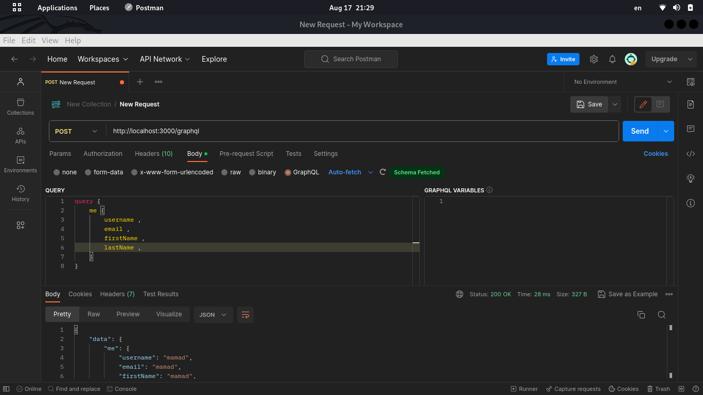

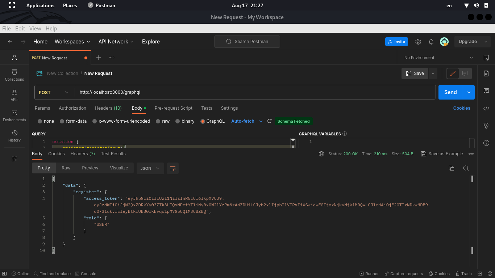

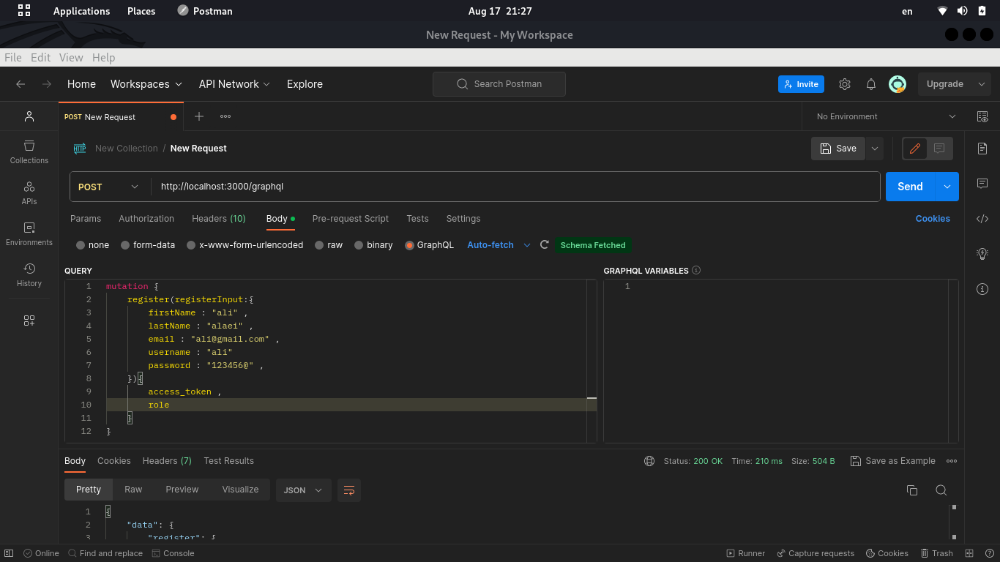

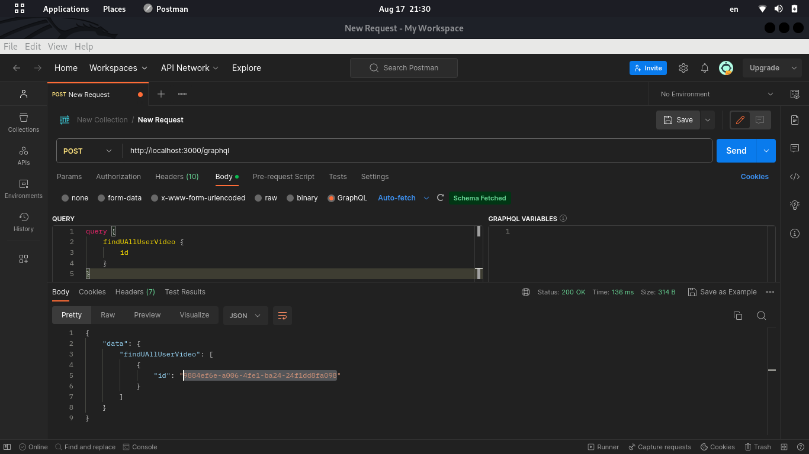


## Getting Started

**Clone the repository:**

```bash
git clone https://github.com/BaseMax/AparatExpressGraphQLTS.git
```

Or download the source code from: AparatExpressGraphQLTS

**Install dependencies:**

```bash
cd AparatExpressGraphQLTS
npm install
```

Set up your environment variables by creating a `.env` file at the root of the project. You can use the provided `.env.example` as a template.

**Start the server:**

```bash
npm run start:dev
```


The GraphQL playground will be accessible at `http://localhost:3000/graphql` by default. You can explore and test the API using this interface.

## Project Structure

The project structure is organized as follows:

```
AparatExpressGraphQLTS/
├── src/
│   ├── config/
│   │   ├── db.ts         # MongoDB configuration
│   │   └── ...
│   ├── controllers/
│   │   ├── user.ts       # User-related logic
│   │   ├── video.ts      # Video-related logic
│   │   └── ...
│   ├── models/
│   │   ├── user.ts       # User schema
│   │   ├── video.ts      # Video schema
│   │   └── ...
│   ├── routes/
│   │   ├── auth.ts       # Authentication routes
│   │   ├── video.ts      # Video-related routes
│   │   └── ...
│   ├── schema/
│   │   ├── index.ts      # GraphQL schema and resolvers
│   │   └── ...
│   ├── app.ts            # Express app configuration
│   └── ...
├── .env.example          # Example environment variables
├── .gitignore
├── package.json
├── tsconfig.json
└── README.md
```

## GraphQL

| Query/Mutation Name       | Description                                       | Example                                           |
| ---------------- | ------------------------------------------------- | ------------------------------------------------- |
| `getUser`        | Get user details by ID.                          | `getUser(id: ID!): User`                          |
| `getVideo`       | Get video details by ID.                         | `getVideo(id: ID!): Video`                        |
| `listVideos`     | List videos with optional filtering and sorting. | `listVideos(filter: VideoFilter, sort: VideoSort, pagination: PaginationInput): [Video]` |
| `searchVideos`   | Search videos by title or description.           | `searchVideos(query: String!): [Video]`           |
| `listCategories` | List all video categories.                       | `listCategories: [Category]`                     |
| `listComments`   | List comments for a video.                       | `listComments(videoId: ID!): [Comment]`           |
| `getUserLikes`   | List videos liked by a user.                     | `getUserLikes(userId: ID!): [Video]`              |
| `getPlaylist`    | Get playlist details by ID.                      | `getPlaylist(id: ID!): Playlist`                  |
| `listPlaylists`  | List playlists with optional filtering.          | `listPlaylists(filter: PlaylistFilter): [Playlist]` |
| `createPlaylist` | Create a new playlist.                           | `createPlaylist(input: CreatePlaylistInput!): Playlist` |
| `updatePlaylist` | Update playlist details by ID.                  | `updatePlaylist(id: ID!, input: UpdatePlaylistInput!): Playlist` |
| `deletePlaylist` | Delete a playlist by ID.                        | `deletePlaylist(id: ID!): Boolean`                |
| `addVideoToPlaylist` | Add a video to a playlist.                   | `addVideoToPlaylist(playlistId: ID!, videoId: ID!): Playlist` |
| `removeVideoFromPlaylist` | Remove a video from a playlist.         | `removeVideoFromPlaylist(playlistId: ID!, videoId: ID!): Playlist` |
| `getTag`         | Get tag details by ID.                           | `getTag(id: ID!): Tag`                            |
| `listTags`       | List all available tags.                         | `listTags: [Tag]`                                |
| `getAuthor`      | Get author details by ID.                        | `getAuthor(id: ID!): Author`                     |
| `listAuthors`    | List all authors.                                | `listAuthors: [Author]`                          |
| `getCategory`    | Get category details by ID.                      | `getCategory(id: ID!): Category`                 |
| `getComment`     | Get comment details by ID.                       | `getComment(id: ID!): Comment`                   |
| `createUser`     | Create a new user.                               | `createUser(input: CreateUserInput!): User`       |
| `updateUser`     | Update user details by ID.                       | `updateUser(id: ID!, input: UpdateUserInput!): User` |
| `deleteUser`     | Delete a user by ID.                             | `deleteUser(id: ID!): Boolean`                    |
| `uploadVideo`    | Upload a new video.                              | `uploadVideo(input: UploadVideoInput!): Video`    |
| `updateVideo`    | Update video details by ID.                     | `updateVideo(id: ID!, input: UpdateVideoInput!): Video` |
| `deleteVideo`    | Delete a video by ID.                            | `deleteVideo(id: ID!): Boolean`                   |
| `addLike`        | Add a like to a video.                           | `addLike(videoId: ID!): Video`                   |
| `removeLike`     | Remove a like from a video.                      | `removeLike(videoId: ID!): Video`                |
| `addComment`     | Add a comment to a video.                        | `addComment(videoId: ID!, input: CommentInput!): Comment` |
| `updateComment`  | Update a comment by ID.                          | `updateComment(id: ID!, input: UpdateCommentInput!): Comment` |
| `deleteComment`  | Delete a comment by ID.                          | `deleteComment(id: ID!): Boolean`                |
| `createPlaylist` | Create a new playlist.                           | `createPlaylist(input: CreatePlaylistInput!): Playlist` |
| `updatePlaylist` | Update playlist details by ID.                  | `updatePlaylist(id: ID!, input: UpdatePlaylistInput!): Playlist` |
| `deletePlaylist` | Delete a playlist by ID.                        | `deletePlaylist(id: ID!): Boolean`                |
| `addVideoToPlaylist` | Add a video to a playlist.                   | `addVideoToPlaylist(playlistId: ID!, videoId: ID!): Playlist` |
| `removeVideoFromPlaylist` | Remove a video from a playlist.         | `removeVideoFromPlaylist(playlistId: ID!, videoId: ID!): Playlist` |
| `createTag`      | Create a new tag.                                | `createTag(input: CreateTagInput!): Tag`          |
| `updateTag`      | Update tag details by ID.                        | `updateTag(id: ID!, input: UpdateTagInput!): Tag` |
| `deleteTag`      | Delete a tag by ID.                              | `deleteTag(id: ID!): Boolean`                    |
| `createAuthor`   | Create a new author.                             | `createAuthor(input: CreateAuthorInput!): Author` |
| `updateAuthor`   | Update author details by ID.                     | `updateAuthor(id: ID!, input: UpdateAuthorInput!): Author` |
| `deleteAuthor`   | Delete an author by ID.                          | `deleteAuthor(id: ID!): Boolean`                 |
| `createCategory` | Create a new category.                           | `createCategory(input: CreateCategoryInput!): Category` |
| `updateCategory` | Update category details by ID.                  | `updateCategory(id: ID!, input: UpdateCategoryInput!): Category` |
| `deleteCategory` | Delete a category by ID.                        | `deleteCategory(id: ID!): Boolean`                |
| `createComment`  | Create a new comment.                            | `createComment(input: CreateCommentInput!): Comment` |
| `updateComment`  | Update comment details by ID.                   | `updateComment(id: ID!, input: UpdateCommentInput!): Comment` |
| `deleteComment`  | Delete a comment by ID.                         | `deleteComment(id: ID!): Boolean`                |

## Contributing

Contributions are welcome! If you find any issues or would like to suggest improvements, please open an issue or submit a pull request.

## License

This project is licensed under the GPL-3.0 License - see the LICENSE file for details.

Copyright 2023, Max Base
